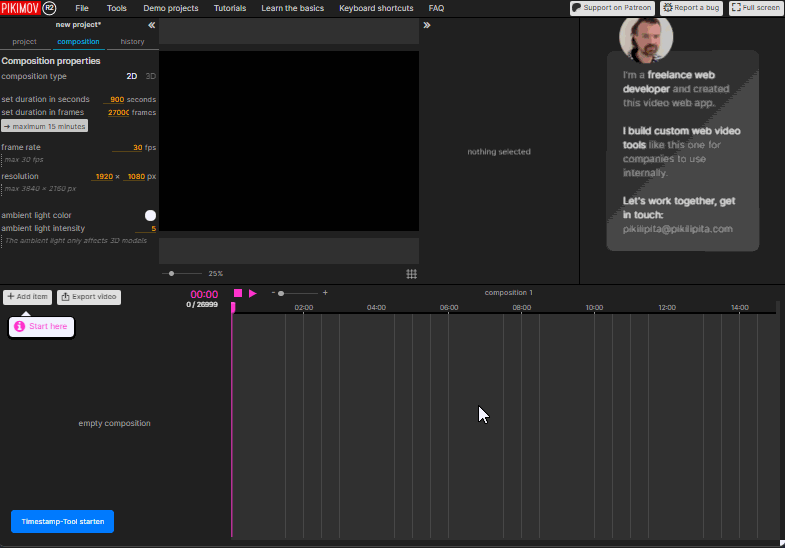
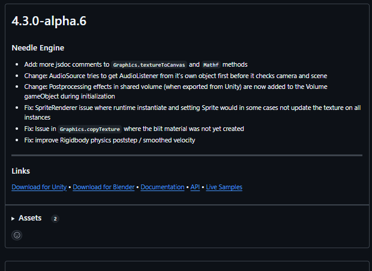

# TampermonkeyUserscript-Videos
TampermonkeyUserscripts for VideoDoku

## Pikimov

[Pikimov](https://pikimov.com/) is like Premiere/After Effects for the browser. I needed a timestamp tool for it, so I created a small extension that adds this functionality.

Unfortunately, you have to press a button in the corner after the interface has loaded to activate the tool (see GIF for reference).

Features:
- Create ,Delet and edit timestamps
- Export timestamps to the clipboard in YouTube format

Missing Features:
- Timestamps are not saved within Pikimov's project files.

[⬇️Install: Pikimov Youtube Timestamps](https://github.com/Dalbyte/TampermonkeyUserscript-Videos/raw/refs/heads/main/script/Pikimov%20Timestamps-0.1.user.js)

---

## Github Highlight Release Nots

The plugin highlights each list entry on a repository's release page. This makes it easier to emphasize the specific point you're discussing when recording a screencapture, helping viewers follow along more effectively.

Drawback:

The GitHub header is also a list element, so the highlighting applies there as well. However, the solution is so simple that I’d rather live with this minor drawback than have it not work at all.

[⬇️Install: Github Release Hover Effect](https://github.com/Dalbyte/TampermonkeyUserscript-Videos/raw/refs/heads/main/script/GitHub%20Release%20List%20Hover%20Effect-1.0.user.js)